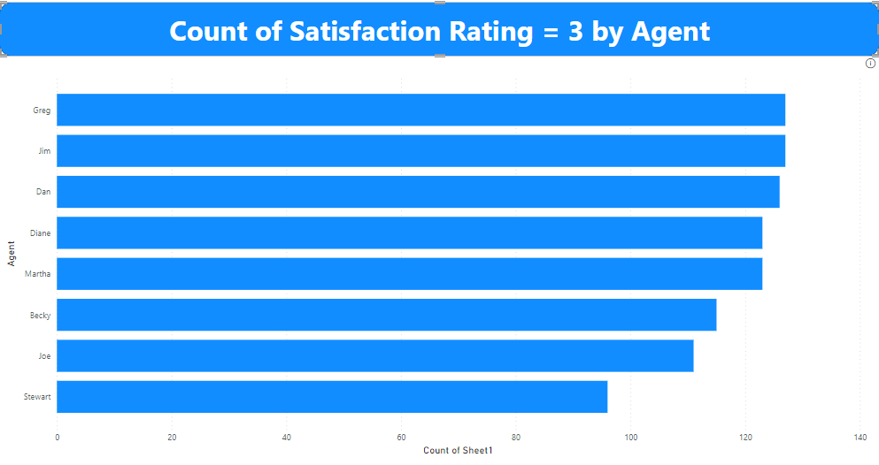

# CALL-CENTRE-TREND-ANALYSIS

## Introduction

This is a Power BI project on customer satisfaction and agent behaviour analysis for a **telecom company**. This is the first task of my internship with PwC Switzerland for a Power BI virtual case experience on Forage.
When it comes to service providers, the priority is the customers/clients and how best to serve/satisfy their needs. Customer service is very important because the more effective the customer’s satisfaction, the more customer it will retain leading to the growth of the company.
For this project, I worked on a customer service dataset that contains the data of calls received, issues/topics of the complaint as well as the performance and behaviour of agents to the concerns of the customers/clients over the period of the first quarter of the year 2021. The aim of this project is to gain insights into the performance of agents and customer satisfaction in the company in order to give recommendations on areas of improvement.

## Promblem Statement

The Call Center Manager, wants to gain insights and know the trends from the dataset gathered in the first quarter of 2021. Most especially, an accurate overview of long-term trends in customer and agent behaviour.
The main objective of this project was to create a dashboard in Power BI for the call centre manager that reflects all relevant Key Performance Indicators (KPIs) and metrics in the dataset. He wants to see the following 
The Key Performance Indicators.
The Key Performance Indicators include:
1.	Overall customer satisfaction
2.	Overall calls answered/abandoned
3.  The average speed of answer
4.  Average Satisfaction
5.  Agent’s performance quadrant.

## Skills/Concept Demonstrated

The tool used for the analysis was Microsoft Power BI. The Power BI concepts that were used include;
 - DAX (Data Analysis Expression) Concept for Calculated Measures.
 - Power Query Editor for data cleaning (Conditional Columns and Added Columns)
 - Data Visualization

## Data Sourcing

The dataset was obtained through PwC Switzerland Case Experience on Forage which contains data on customers, calls received, calls resolved, attending agent, time and duration of calls, and date of calls received.
Data Structure
The data is in a structured Excel Worksheet document (xls) format. It contains 10 columns and 5000 rows. The table had the following columns:
- Call ID: It contains unique identity codes for individual calls received.
- Agent: It contains the name of the agent that received the call.
- Answered: It contains the status of the call received, either answered or missed.
- Average Talk Duration: It contains the average duration of the call.
- Date: It contains the date the calls were received
- Resolved: It contains data on the status of the reason for the call, either resolved or not.
- Satisfaction rating: It contains the satisfaction rating by the customer.
- Speed of answer in seconds: It contains how fast (in seconds) the call was answered.
- Time: It contains the exact time the call was received.
- Topic: It contains the reason the customer called.

## Data Transformation

Before moving to any analysis, the Call Center dataset was imported into Power Query on Microsoft Power BI. The following transformations were done:
-	Check for blank cells or missing values in the dataset.
-	Correction of data types, especially dates, time, and duration.

## Modelling

There was no modeling needed as the dataset contains only one detailed table.

## Analysis and Visualizations

In this step, I carried out an exploratory analysis of the data to answer the Key Performance Indicators question that were stated earlier.

Objective One
Overall customer satisfaction — What is the overall customer sactisfaction? This was gotten by taking the percentage of Resolved call.

Objective Two
Overall calls answered/abandoned — What is the total number of calls answered?
What is the total number of calls abandoned/missed?

Objective Three
The average speed of answer — What is the average duration spent before calls were answered?

Objective Four
Average Satisfaction

Objective Five
Agent’s performance quadrant.

# Satisfaction Ratings of Agents on Scale of 1-5

Satisfaction Rating = 1

Satisfaction Rating = 2

Satisfaction Rating = 3

Satisfaction Rating = 3

 Satisfaction Rating = 5

# Overview of the Dashboard

  

